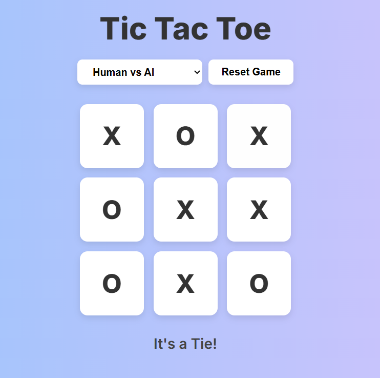

# Tic-Tac-Toe Web Application

This project is a simple and interactive **Tic-Tac-Toe** web application built using HTML, CSS, and JavaScript. Users can play against each other, taking turns to place their markers, while the application tracks the game state and determines the winner.

---

## Features

- **Interactive Gameplay** – Users can click cells to place their markers.  
- **Game State Tracking** – Keeps track of moves and detects winning conditions.  
- **Responsive Design** – Works on desktops, tablets, and mobile devices.  
- **Easy Customization** – Colors, markers, and grid size can be updated easily.  
- **Engaging UI** – Simple and clean interface for a pleasant user experience.

---

## Tech Stack

- HTML5  
- CSS3  
- JavaScript (ES6+)

---

## About

This Tic-Tac-Toe project was created to practice DOM manipulation, event handling, and game logic in JavaScript. It demonstrates fundamental front-end development skills while providing a fun and interactive game.  

Live demo: [https://abhaydutta.github.io/PRODIGY_WD_03/](https://abhaydutta.github.io/PRODIGY_WD_03/)

---

## Screenshot

